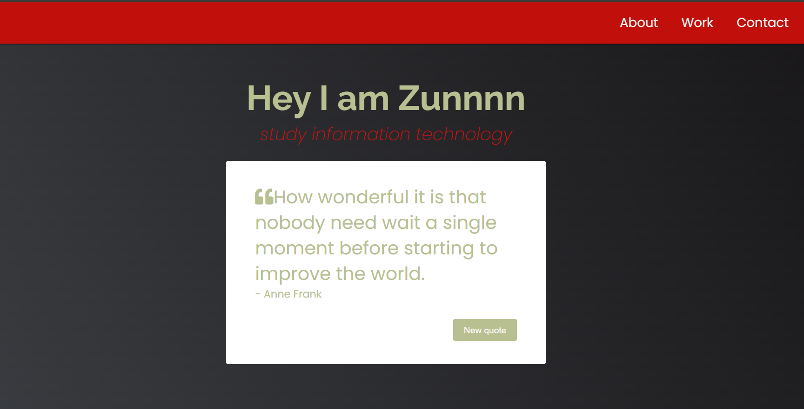
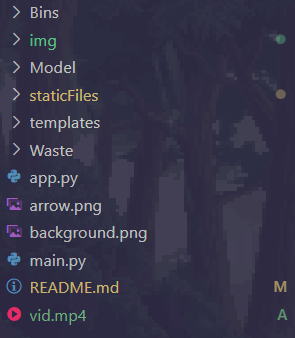
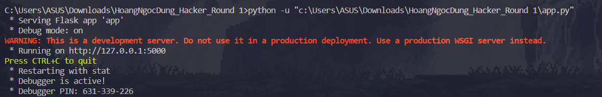
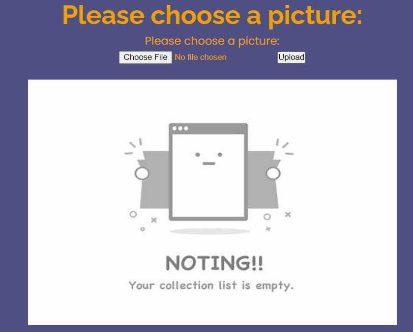
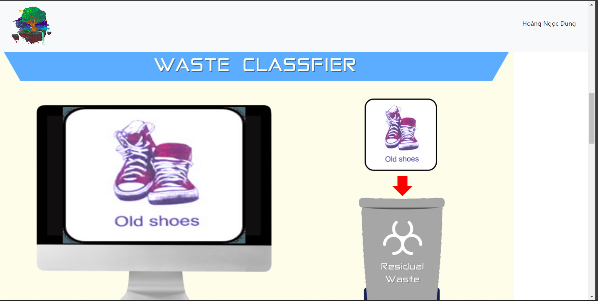
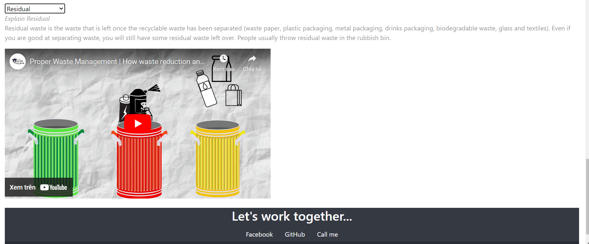

# PHÂN LOẠI RÁC
## NỘI DUNG

- [1. Mô tả](#1-mô-tả)
    
- [2. Cách sử dụng](#2-cách-sử-dụng)

- [3. Nguồn](#3-nguồn)

### 1. Mô tả

- Trang web được tạo ra với mục đích giúp người dùng dễ dàng phân loại các loại rác và hiểu lý do tại sao chúng được phân loại như vậy. Đồng thời gợi ý cho người dùng cách tái chế chúng.

  - 

- Điều này giúp môi trường chúng ta đang sống trở nên xanh sạch đẹp hơn bởi hành động của mỗi cá nhân.

- [Video demo web](vid.mp4)

- Triển khai giao diện web sử dụng Flask

- Model training Keras, sử dụng OpenCV Python

### 2. Cách sử dụng

<p align="center">
  
        <br>
            <em>Cấu trúc folder</em>
</p>

- Đầu tiên ta cần set up, tải các thư viện cũng như môi trường thích hợp được dùng trong file **app.py**. Bởi khá đơn giản chúng ta chỉ cần run được file **app.py** sẽ chạy được trang web.

```py
from flask import *
from cvzone.ClassificationModule import Classifier
import os
import cv2
import cvzone
from werkzeug.utils import secure_filename
```

- Sau đó sử dụng terminal/cmd run file **app.py** và thực hiện lệnh

  ``` 
    flask run
  ````

  - Sau đó trên trình duyệt web gõ địa chỉ: http://127.0.0.1:5000

    - Hoặc thực hiện lệnh:
  ``` 
  flask run --host=0.0.0.0 --port=80
  ```

  - Lúc này chỉ cần nhập trên trình duyệt web địa chỉ: http://localhost

- Hoặc ta có thể sử dụng extension **Code Runner**
  

- Sau đó ta sẽ upload ảnh về rác mà mình muốn

  

- Ví dụ ảnh về giày cũ thì kết quả sau khi upload là

  

- Ngoài ra ta có thể tìm hiểu thêm thông tin phía dưới trang web 

  

### 3. Nguồn

[Recyclable Waste Classifier using Opencv Python | Computer Vision.](https://www.bing.com/videos/search?q=waaste+classication&&view=detail&mid=FCF4536B62869A0704C0FCF4536B62869A0704C0&&FORM=VRDGAR)

[webapp trash classification](https://github.com/vladalexey/webapp-trash-classification)

